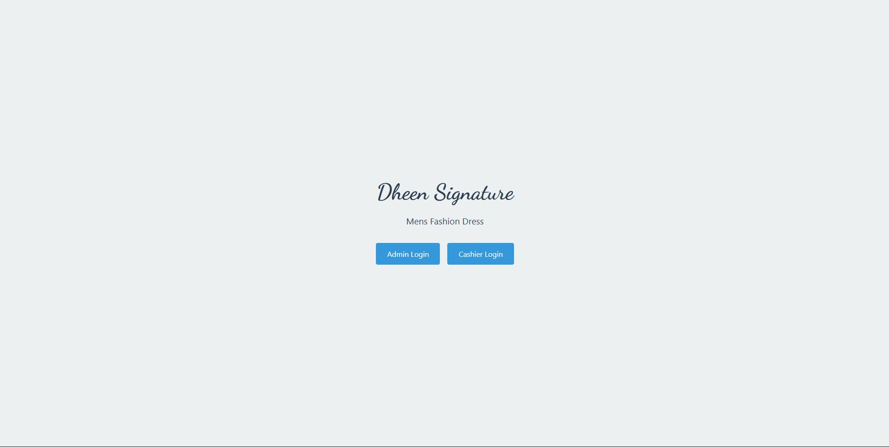
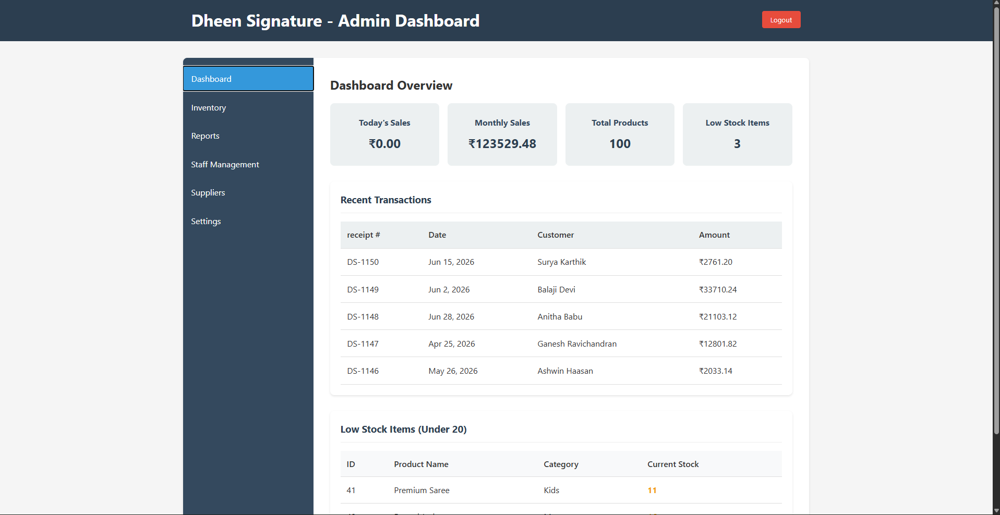
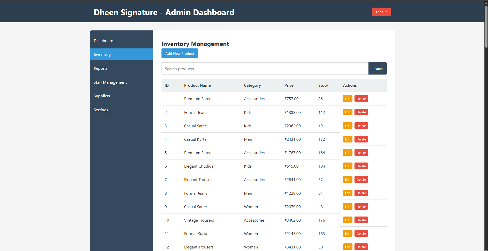
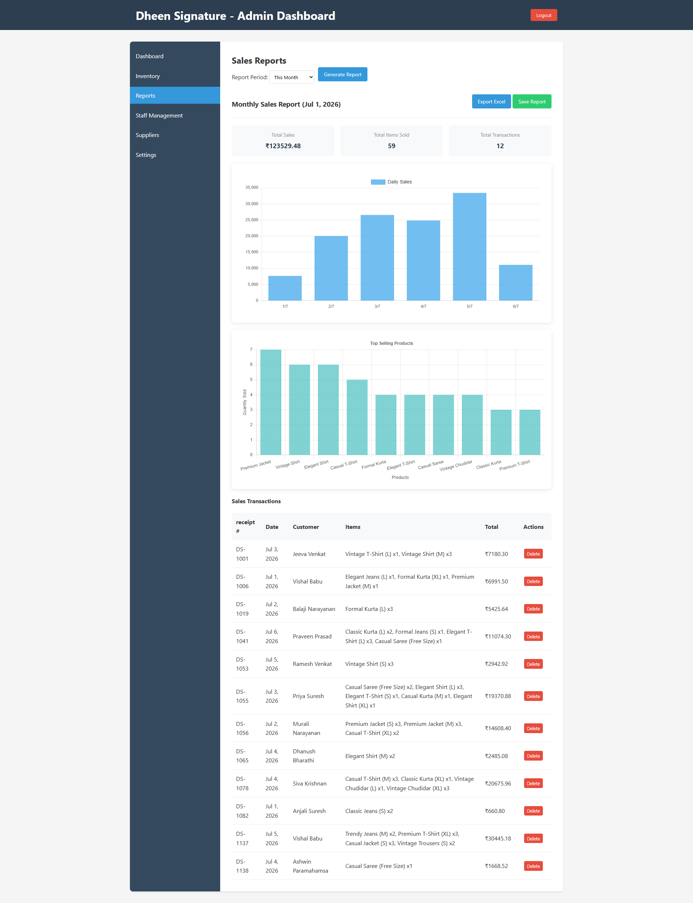
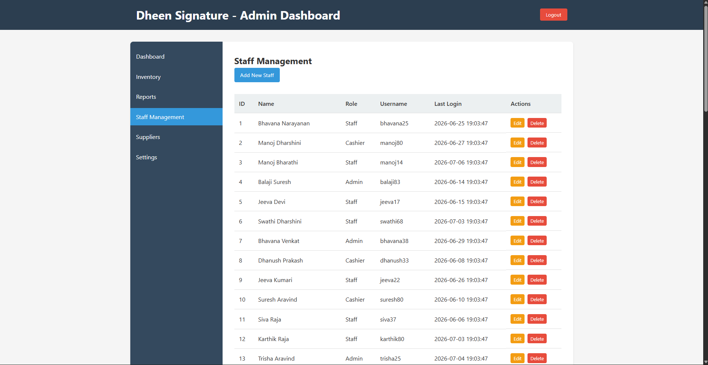
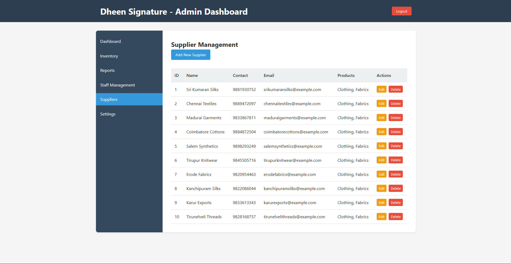
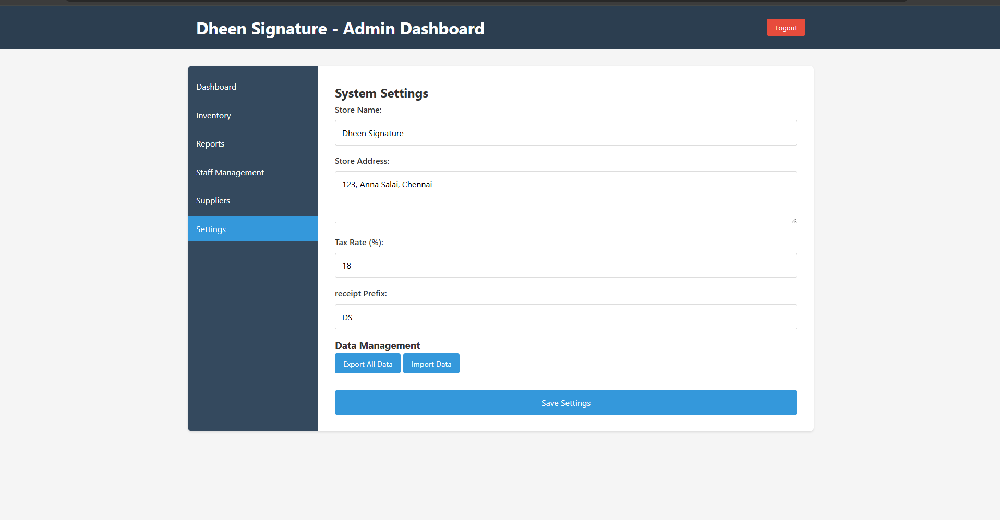
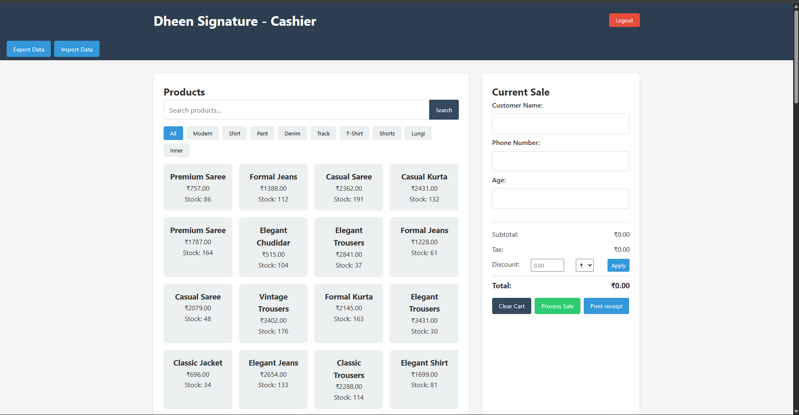
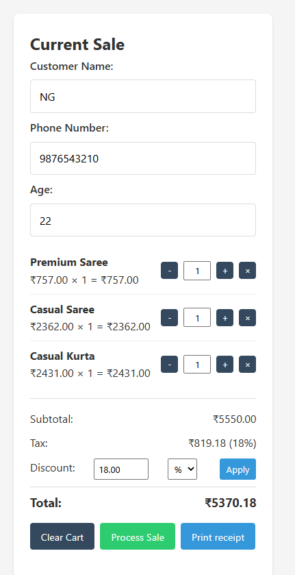
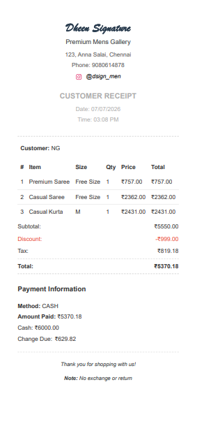

# 🧵 Textile Inventory & Billing Management Syst

A full-stack web application built for a men's fashion retail store to manage
inventory, process sales, generate receipts, track reports, and manage staff
and suppliers — all from a clean admin and cashier interface.

> ⚠️ **Note:** This project was built for a real retail client (Dheen Signature,
> Mens Fashion Dress). Source code is private due to client confidentiality.
> All screenshots below use demo data for portfolio purposes.

---

## 🚀 Overview
Built to replace manual billing and stock tracking with a digital system.
The system has two roles — **Admin** (full control) and **Cashier** (POS
billing only) — so the store owner and staff each see only what they need.

## 🛠️ Tech Stack
- **Frontend**: HTML, CSS, JavaScript
- **Storage**: localStorage / JSON-based data management
- **Receipt Generation**: Print-ready HTML receipt layout
- **Deployment**: Local deployment for the client store

---

## ✨ Key Features

### 👑 Admin Role
- Dashboard with today's sales, monthly sales, total products, and low stock alerts
- Inventory management — add, edit, delete products with category and stock tracking
- Sales reports — daily/monthly charts, top-selling products, full transaction history
- Staff management — add/edit staff with roles (Admin, Cashier, Staff)
- Supplier management — track supplier contacts and product categories
- System settings — store name, address, tax rate, receipt prefix, data import/export

### 🖥️ Cashier Role
- POS interface with product grid, category filters, and search
- Current sale panel — add items, adjust quantity, apply discount (% or ₹)
- Real-time subtotal, tax (18% GST), discount, and total calculation
- Print-ready customer receipt with itemized bill, payment info, and change due

---

## 📸 Screenshots

### 🔐 Login Page
Dual-role login — Admin and Cashier access from a single clean landing page.



---

### 📊 Admin Dashboard
Overview of today's sales, monthly revenue, total products, and low-stock
alerts — plus a list of recent transactions.



---

### 📦 Inventory Management
Full product list with category, price, and stock level. Edit or delete
any product, or add new ones with the "Add New Product" button.



---

### 📈 Sales Reports
Monthly sales summary with daily bar chart, top-selling products chart,
and full transaction history. Supports Excel export and report saving.



---

### 👥 Staff Management
Manage all staff members with their role, username, and last login time.
Three roles supported: Admin, Cashier, and Staff.



---

### 🚚 Supplier Management
Track all fabric and clothing suppliers with contact details, email,
and product categories.



---

### ⚙️ System Settings
Configure store name, address, tax rate, receipt prefix, and manage
data backup via export/import.



---

### 🖥️ Cashier POS Interface
Product grid with category filters and search. The "Current Sale" panel
on the right collects customer details and builds the cart in real time.



---

### 🛒 Active Sale with Cart
Items added to cart with quantity controls, 18% GST auto-calculated,
and an 18% discount applied — showing real-time total update.



---

### 🧾 Customer Receipt
Print-ready receipt with store branding, itemized bill, discount,
tax, total, payment method, cash received, and change due.



---

## 🔌 How It Works

```
Admin sets up inventory + staff + settings
              ↓
Cashier logs in → browses products → adds to cart
              ↓
Enters customer details → applies discount
              ↓
Processes sale → prints receipt
              ↓
Admin views sales report + inventory updates automatically
```

## 📈 Future Improvements
- Cloud sync for multi-device access
- Customer loyalty points system
- Barcode scanner integration for faster billing
- WhatsApp receipt delivery

## 📌 Status
Fully developed and deployed for a real retail client.
Currently live and in active use at the store.
Source code is private due to client confidentiality agreement.
